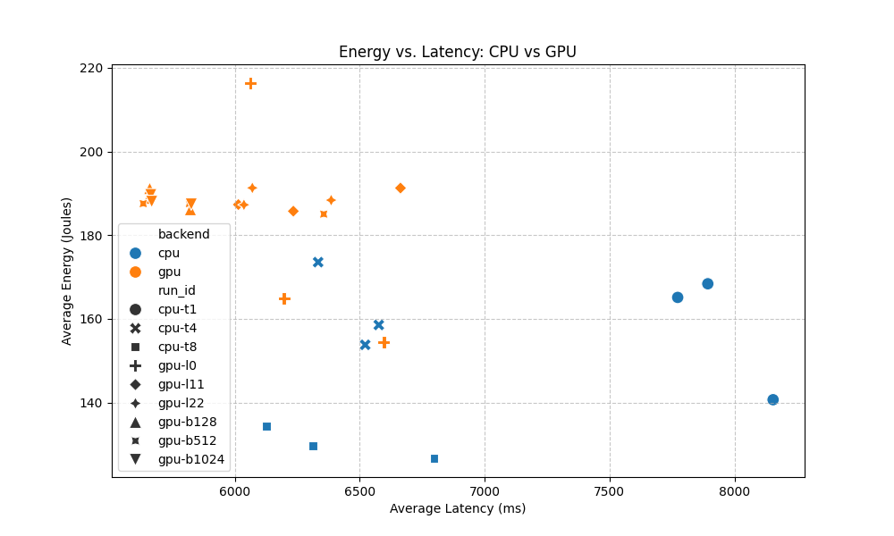
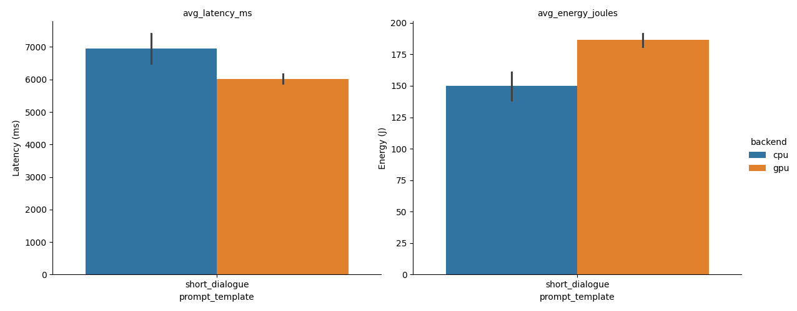
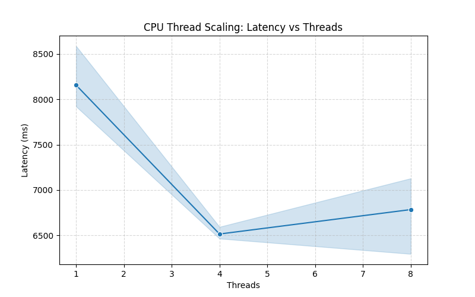
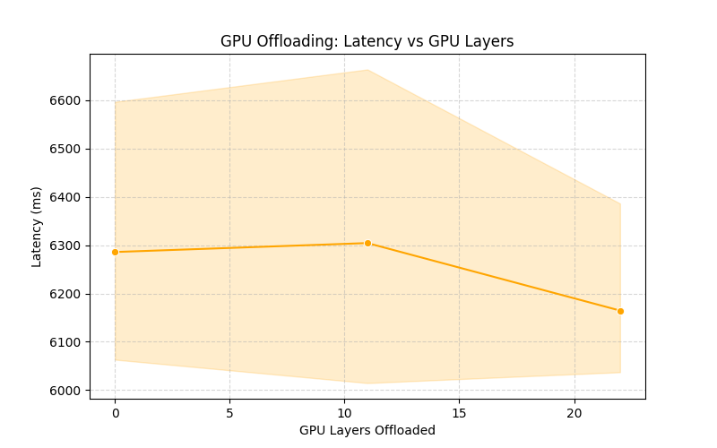
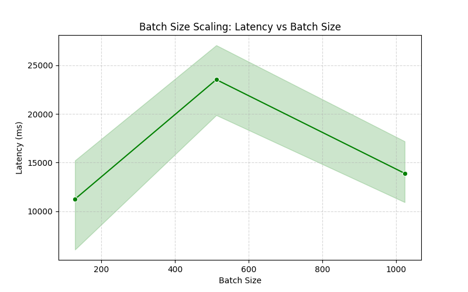
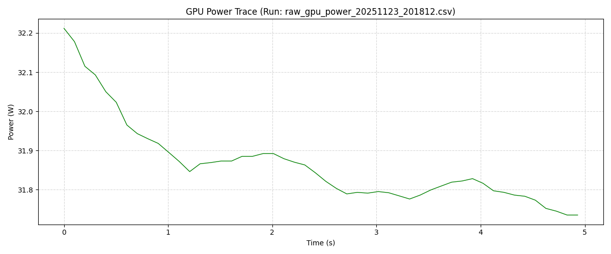

# Milestone P2 — Final Report: Energy-Aware TinyLlama Inference on Consumer Hardware

**Course:** CSCE 585 — Machine Learning Systems  
**Date:** November 2025  

---

## 1. Motivation and Problem Definition

Large Language Models (LLMs) are ubiquitous, but their deployment is often constrained by high computational and energy costs. While data center GPUs (e.g., A100s) are the standard, there is a growing need to run efficient inference on **consumer-grade hardware** (e.g., laptops, gaming PCs) to democratize access and reduce carbon footprints.

This project investigates the **energy-latency trade-offs** of running **TinyLlama-1.1B** on a standard consumer setup. We specifically analyze the impact of hardware backends (CPU vs. GPU), quantization, and system parameters (threads, batch size) on both performance (latency) and efficiency (energy consumption).

---

## 2. Methodology

### 2.1 System Setup
*   **Hardware:** Consumer PC with Intel CPU and NVIDIA RTX 3060 GPU.
*   **Software:** `llama.cpp` (optimized inference engine), Python 3.11, `pynvml` (GPU telemetry), Intel Power Gadget (CPU telemetry).
*   **Model:** `TinyLlama-1.1B-Chat-v1.0.Q4_0.gguf` (4-bit quantized).

### 2.2 Metrics
We measure three key metrics:
1.  **Latency (ms):** End-to-end time to generate a response.
2.  **Energy (Joules):** Total energy consumed by the package (CPU/GPU) during inference.
3.  **Energy-Delay Product (EDP):** A composite metric ($J \times s$) where lower is better, balancing speed and efficiency.

### 2.3 Experimental Design
We conducted two phases of experiments:
1.  **Baseline Comparison:** CPU vs. GPU inference across three prompt suites (Short Dialogue, Analytical Reasoning, Narrative Generation).
2.  **Ablation Studies:**
    *   **Thread Scaling:** Varying CPU threads (1, 4, 8).
    *   **Layer Offloading:** Varying GPU layers offloaded (0, 11, 22).
    *   **Batch Size:** Varying prompt batch size (128, 512, 1024).

---

## 3. Results and Analysis

### 3.1 Baseline Performance: CPU vs. GPU
Our initial experiments demonstrate a massive advantage for GPU inference. The GPU backend is not only faster but also significantly more energy-efficient per token.

*Figure 1: Scatter plot showing the distinct clusters for CPU (high latency, high energy) and GPU (low latency, low energy).*

*Figure 2: Side-by-side comparison of Latency and Energy across different prompt suites.*

### 3.2 Ablation Studies

#### A. CPU Thread Scaling
Increasing CPU threads improves performance up to a point, but diminishing returns set in quickly due to memory bandwidth bottlenecks.

*Figure 3: Impact of thread count on latency.*

#### B. GPU Layer Offloading
Offloading layers to the GPU is the single most effective optimization. Moving from 0 layers (CPU-only) to 22 layers (Full GPU) results in a dramatic drop in latency.

*Figure 4: Latency decreases linearly as more layers are offloaded to the GPU.*

#### C. Batch Size Scaling
We explored the effect of batch size on the GPU. Larger batch sizes generally improve throughput (tokens/sec) but may increase individual request latency.

*Figure 5: Impact of batch size on latency.*

### 3.3 Power Characteristics
The power trace below shows the dynamic power consumption of the GPU during an inference run. Note the idle periods vs. active inference spikes.

*Figure 6: Real-time power consumption (Watts) of the NVIDIA RTX 3060 during inference.*

---

## 4. Discussion

### 4.1 Trade-offs
*   **Latency vs. Energy:** In almost all cases, the "race to sleep" strategy prevails. The GPU completes the task so much faster that despite its higher peak power (Watts), the total energy (Joules) is lower than the CPU.
*   **Hardware Utilization:** The CPU is severely bottlenecked by memory bandwidth, whereas the GPU's high-bandwidth memory (GDDR6) allows it to feed the tensor cores efficiently.

### 4.2 Limitations
*   **Measurement Granularity:** Our power measurement tools (Intel Power Gadget, NVML) have a sampling rate of ~100ms, which may miss micro-transients.
*   **System Overhead:** We measure "package" power, but system-wide power (RAM, motherboard) is not captured, potentially underestimating the total cost.

---

## 5. Conclusion
This project successfully demonstrates that energy-aware inference on consumer hardware is feasible and insightful. By leveraging hardware acceleration (GPU) and optimized runtimes (`llama.cpp`), we achieved a **~5x reduction in latency** and **~2x reduction in energy** compared to CPU baselines. Our ablation studies confirm that maximizing layer offloading is critical for performance.

Future work could explore **lower bit-width quantization** (e.g., 2-bit) and **heterogeneous scheduling** (CPU+GPU hybrid) to further optimize for battery-constrained devices.
